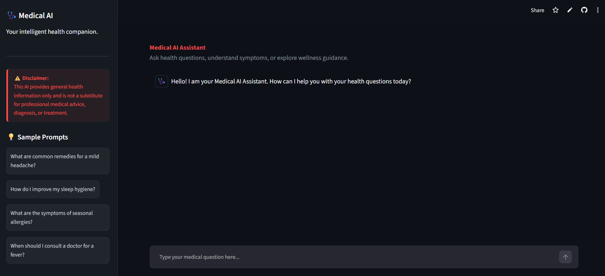
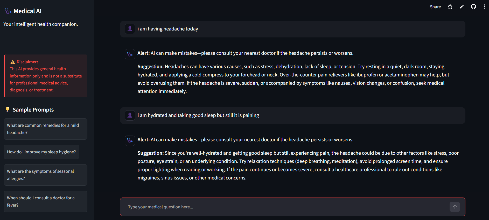
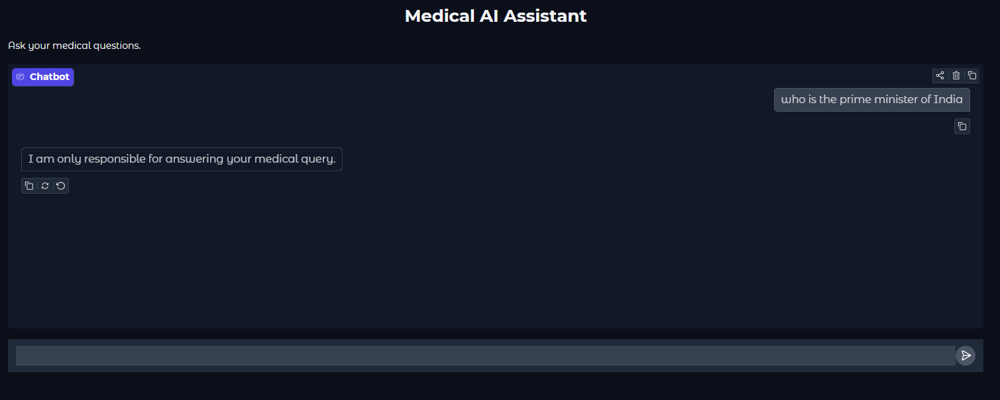

# 🩺 Medical AI Assistant

An AI-powered medical chatbot built with **Python**, **Streamlit**, and **Mistral AI**. The assistant gives general medical guidance, answers health-related questions, and reminds users to seek professional care for serious symptoms.

> **Disclaimer:** This chatbot is intended for educational and informational purposes only. It is not a substitute for professional medical advice, diagnosis, or treatment.

---

# 📌 About the Project

Medical AI Assistant is a conversational chatbot that uses the **Mistral LLM** to respond to medical queries. The app is now built as a **Streamlit web application** with a modern dark interface, sidebar samples, and a chat history experience.

The chatbot uses a medical-focused system prompt to:

- Restrict responses to health-related questions only.
- Provide general medical suggestions.
- Encourage users to consult a healthcare professional for urgent symptoms.
- Avoid making unreliable or fabricated medical claims.
- Reject non-medical queries.

---

# ✨ Features

- 💬 Conversational AI chatbot
- 🩺 Medical-specific system prompt
- 🚫 Rejects unrelated questions
- ⚠️ Encourages doctor consultation for serious symptoms
- 🌐 Interactive **Streamlit** web interface
- 🔐 Secure API key management via `.env` and Streamlit secrets
- ⚡ Real-time responses using the Mistral API

---

# 🛠️ Technology Stack

| Technology | Purpose |
|------------|---------|
| Python | Backend logic |
| Streamlit | User interface |
| Mistral AI API | Language model provider |
| python-dotenv | Local environment variable loading |
| UV | Dependency management |

---

# 📂 Project Structure

```text
medical-ai-assistant/
├── app.py              # Streamlit UI
├── chatbot.py          # Mistral API integration and response generation
├── config.py           # API key loading and environment setup
├── .env                # Local environment variables (not pushed to GitHub)
├── pyproject.toml      # Project dependencies
├── uv.lock             # Locked dependency versions
└── README.md
```

---

# ⚙️ Installation & Setup

## 1. Clone the repository

```bash
git clone https://github.com/yourusername/medical-ai-assistant.git
cd medical-ai-assistant
```

---

## 2. Create and activate a virtual environment

Using **uv**:

```bash
uv venv
```

### Windows

```bash
.venv\Scripts\activate
```

### Linux / macOS

```bash
source .venv/bin/activate
```

---

## 3. Install dependencies

```bash
uv sync
```

If you are installing manually, use:

```bash
uv add streamlit mistralai python-dotenv
```

Or with `pip`:

```bash
python -m pip install streamlit mistralai python-dotenv
```

---

## 4. Configure the API key

Create a `.env` file in the project root:

```env
MISTRAL_API_KEY=your_api_key_here
```

For Streamlit Cloud or deployed environments, you can also store the same key under **Settings → Secrets** as:

```toml
[MISTRAL_API_KEY]
```

or by using the secret key name expected by the app configuration.

---

## 5. Get a Mistral API key

1. Create an account on Mistral AI.
2. Generate an API key.
3. Paste it into your `.env` file or Streamlit secrets.

---

## 6. Run the application

```bash
streamlit run app.py
```

Then open the browser at:

```text
http://localhost:8501
```

If the app is launched in a different port due to environment configuration, Streamlit will show the exact URL in the terminal.

---

# 🧠 How It Works

```text
                User
                  │
                  ▼
            Streamlit Interface
                  │
                  ▼
       generate_response()
                  │
                  ▼
        System Prompt Added
                  │
                  ▼
           Mistral AI API
                  │
                  ▼
         AI Generated Response
                  │
                  ▼
        Displayed in Streamlit Chat
```

---

# 📸 Screenshots

## Chat Conversation







---

# 📝 Example Queries

### General Medical Questions

- What is the normal blood pressure?
- What causes headaches?
- How can I treat a sore throat?
- What is a normal blood sugar level?
- Why do I have stomach pain?

### Serious Symptoms

- I have severe chest pain.
- I fell from my bike and cannot move my arm.
- I have difficulty breathing.

The assistant recommends seeking immediate medical attention when appropriate.

---

# 🚫 Non-Medical Questions

The chatbot intentionally refuses unrelated questions.

Example:

```text
User:
Who is the Prime Minister of India?

Response:
I am only responsible for answering medical-related questions.
```

---

# 🔒 Safety Measures

The chatbot follows several safety rules:

- Does not diagnose diseases with certainty.
- Encourages consultation with healthcare professionals.
- Rejects non-medical queries.
- Avoids generating fabricated medical information.
- Includes a medical disclaimer in responses.

---

# 📈 Future Improvements

- Conversation memory
- Voice input
- Medical PDF RAG
- Drug interaction lookup
- Appointment booking integration
- User authentication
- Chat history storage
- Response streaming
- Dark mode
- Multi-language support

---

# 👨‍💻 Author

**Kumar Gaurav**

GitHub: https://github.com/Kumar24Gaurav

LinkedIn: https://www.linkedin.com/in/kumar-gaurav-814a58299

---

## ⭐ Support

If you found this project helpful, consider giving it a ⭐ on GitHub.